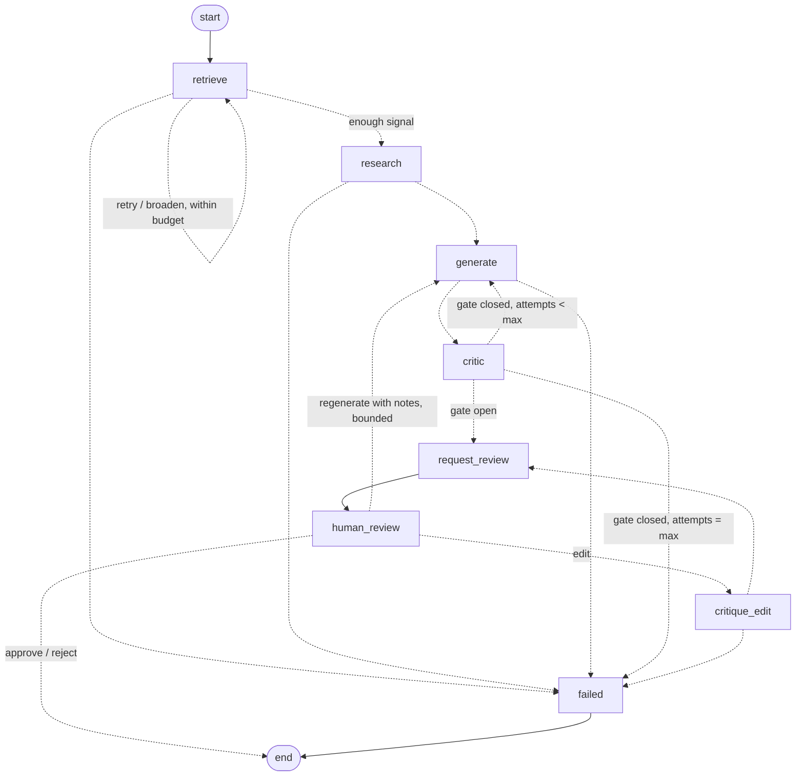

# Architecture

## 1. Product purpose

social-growth-agent helps creators, technical founders and small businesses grow on X. It
researches what is working in their niche, drafts posts that fit their strategy, critiques the
drafts, asks a human to approve them, publishes, measures the results, and feeds what it learns
back into the next round. The engineering goal is a **closed, measurable learning loop** with
clear control flow, not a pile of prompts.

## 2. Deterministic orchestration, probabilistic agents

The central design rule, added in Phase 2 when real LLMs arrived:

> **LLMs produce typed judgements. Deterministic code decides what happens next.**

| Decided by the LLM (probabilistic) | Decided by application code (deterministic) |
|---|---|
| Research themes, opportunities, confidence, claim type (observation or hypothesis) | Which posts the research is based on, and where they came from (`ResearchSource`); that every cited evidence id was supplied; limitations for sample size, missing impressions and synthetic data |
| Post text, hook, rationale, which earlier candidate it revises | Ids, lineage, attempt numbers, strategy version |
| Critic recommendation, score, risks, soft issues | Hard policy (length, format, blank content) and the **final verdict** |
| | Whether the batch is good enough for review (`CriticGate`) |
| | Whether to retry, how many times, and when to fail (`RunConfig`, routing) |
| | Human review, the edit invariant, and approval eligibility |

The model never returns a routing instruction, and nothing in its output is used as one. Routing
functions (`graph/routing.py`) read only validated state. A model that misbehaves can at worst
produce output that fails validation, and then the run fails with a recorded error.

## 3. The learning loop

```
Research -> Content generation -> Critic -> Human approval -> Publishing
    ^                                                              |
    |                                                              v
Strategy update  <-----------------  Analytics  <----------  Metrics collection
```

Phases 1 to 4 implement research (from mock fixtures or live X) through human approval,
Phase 5 publishing and Phase 6 metrics collection, both as workers over durable rows outside
the graph. Analytics and strategy update (Phase 7) exist only in the types
(`PerformanceInsight`, `Experiment`); `PublishState` and `PostMetrics` are deprecated Phase 1
placeholders kept because stored checkpoints contain them.

## 4. Agents and their contracts

Every agent is a small class. It renders a prompt, calls the provider through
`agents/base.call_llm`, then converts the **LLM output schema** into **domain objects** inside
`validating_output`. The two schemas are deliberately separate. The model never invents ids or
lineage, and every cross-reference is checked. A violation raises `AgentOutputError` carrying
the `LLMCall` record.

| Agent | LLM output schema | Validated into | Checks |
|---|---|---|---|
| Research | `ResearchReport{topic, summary, findings[theme, summary, claim_type, evidence_source_ids, signal_strength], content_opportunities[angle, rationale, finding_indexes], confidence, limitations}` | `list[ResearchFinding]`, `ResearchBrief` | evidence ids ⊆ supplied `source_id`s; opportunity indexes valid; ≥1 finding; deterministic limitations appended by code (§8a) |
| Content | `CandidateBatch{candidates[content, topic, hook_type, format, target_audience, research_finding_ids, rationale, revises_candidate_id]}` | `list[ContentCandidate]` | 1..count candidates; finding ids known; `revises_candidate_id` must be one of the previous attempt's critiqued candidates |
| Critic | `CriticReport{evaluations[candidate_id, recommendation, score, tone_match, factual_risk, originality_risk, issues[category, detail], suggested_revision]}` | `list[Critique]` | exactly one evaluation per candidate; score 0..1; then hard policy |

Prompts live in `agents/prompts/*.md`. Each has Role, Objective, Available inputs, Output
contract, and Rules/Limitations. The research prompt states that the material is supplied by the
application and that the model must not claim to have browsed X or any other source. It also
separates observation, hypothesis and causal claim, forbids causal claims about engagement, and
lists the limitations to state (small sample, incomplete metrics, missing impressions, mixed
audiences, unrepresentative sample). `ClaimType` has no `causal` value, so the schema itself
cannot express one.

LLM output schemas contain no defaults, so every field is required. A test checks each one
against OpenAI's strict-mode schema converter (`tests/test_llm_contracts.py`).

## 5. Critic: hard policy vs. LLM judgement

```
candidate --> LLM evaluation (recommendation, score, risks, soft issues)
          --> policies.find_violations(candidate, ContentPolicy)   # hard rules, code only
          --> policies.final_verdict(recommendation, violations)   # violation => never PASS
          --> Critique{verdict, recommended_verdict, assessment, issues, policy_violations}
```

- **Soft issues** come from the model: `weak_hook`, `unclear`, `low_usefulness`, `boring`,
  `off_brand`, `off_strategy`, `unsupported_claim`, `not_suited_to_x`, `other`.
- **Hard violations** come from code: `max_post_length`, `allowed_format`, `non_blank_content`.
  `ContentPolicy(max_post_length=280, allowed_formats={single})` is configured per run through
  `RunConfig.content_policy`. A new rule is one small `HardRule` class added to `DEFAULT_RULES`.
- A violation downgrades the model's `pass` to `revise`, so the retry loop can fix it. The model's
  `reject` is never upgraded. Both `recommended_verdict` and `verdict` are stored, so disagreement
  between the model and the policy is measurable.

### Critic gate

`policies.CriticGate` is the only place that decides whether a batch may go to human review. The
Phase 2 default is at least one passing candidate. It already supports `min_passing_candidates`
and `min_best_score`, and aggregate or per-dimension thresholds would go here too. Routing
(`route_after_critique`) and `request_review` both ask the gate; neither reimplements it.

## 6. Graph



`retrieve` (Phase 3) is the only node that talks to a social platform; `research` only
interprets what `retrieve` stored. The split keeps retrieval and interpretation apart, and it
means a retried or failed research LLM call never re-fetches (and re-bills) platform data.

### Enough-signal loop (Phase 4)

After every retrieval, `policies.assess_signal` counts the posts collected so far (merged across
retrievals, first occurrence wins) and decides deterministically:

- at least `RunConfig.min_signal_posts` (default 5): **proceed** to research;
- fewer, and another request is allowed: **broaden** and retrieve again;
- fewer, no request left: proceed if there is anything at all (the small-sample limitation is
  stated), otherwise fail with `InsufficientSignalError`.

Broadening is a fixed ladder (`policies.broadened_queries`): the original query, then without
recency/author constraints, then without phrase quotes, then OR-ed with the strategy pillars.
The original query is never modified; the ones used are recorded in
`ResearchSource.broadened_queries`. Transient retrieval failures loop back the same way
(`signal_decision=retry`). Both are bounded by `RunConfig.max_research_attempts` and by the
provider's `max_requests_per_run` (`X_MAX_QUERIES_PER_RUN`), checked against the `ResearchFetch`
records already in state, so every request is counted and none is invisible. With the default
X budget of 1 request the loop never broadens, exactly as in Phase 3. Rate limits still end the
run immediately, and nothing sleeps.

### Regenerate with reviewer notes (Phase 4)

`regenerate` no longer ends the run. `human_review` records the decision (with its note, at
most 1000 characters) and starts a new generation cycle: `generate` receives the reviewed
candidates with their latest critiques plus every reviewer note so far, and runs the normal
critique/retry loop with a fresh `max_generation_attempts` budget. Research is not repeated.
Regeneration rounds are bounded by `RunConfig.max_regenerations` (default 2); past the limit
the decision is refused and the run stays paused. Reject is terminal.

### Retry feedback loop

When the gate is closed and attempts remain, `generate` runs again with
`GraphState.revision_feedback()`: every non-passing candidate of the last attempt paired with its
critique (verdict, soft issues, hard violations, suggested revision). The Content Agent is told to
revise those posts, not start over, and each new candidate records `revises_candidate_id`. The
chain attempt 1 → critique → attempt 2 is therefore explicit in state. The number of attempts is
`RunConfig.max_generation_attempts` (default 3, hard ceiling 10). The model has no say in it.

### Human edit invariant

> Materially edited content must pass critique again before it can be approved.

- An edit never mutates a candidate. `policies.edited_candidate` creates a new candidate with
  `origin=human_edit` and `revises_candidate_id=<original>`. Whitespace-only edits are refused as
  non-material.
- `human_review --edit--> critique_edit`. That node runs the full critic (LLM plus hard policy) on
  the edited candidate, then returns to `request_review`.
- `review.candidate_ids` only ever holds candidates whose latest critique passed. Approval is
  checked against it, and against `latest_critique(candidate).passed` as defence in depth. An edit
  that fails is shown to the reviewer as `ReviewRequest.rejected_edit` and cannot be approved.
- Edits are bounded by `RunConfig.max_edit_rounds` (default 3).

The unsafe path, critic passes → human edits → publish, does not exist in the graph.

### Failure handling

| Failure | Mechanism | Outcome |
|---|---|---|
| Connection error, 5xx, timeout (`TransientProviderError`); LLM rate limits | LangGraph `RetryPolicy` on LLM-calling nodes; for `retrieve`, the graph's own retrieval loop | retried up to 3 attempts (`retrieve`: within `max_research_attempts` and the provider's request budget, every attempt recorded); then as below |
| X rate limit (`RateLimitedError`, HTTP 429) | not transient: never retried, never slept on | reset time recorded in the error and in `research_fetches`; run fails |
| Any provider error left after retries, or a non-retryable one (auth, 4xx, malformed response) | node `error_handler` (`provider_error_handler`) | `RunError` recorded, `status=failed`, `goto failed`. `start_run` returns normally. |
| Invalid, truncated or filtered output, empty result, refusal, contract violation (`RunAbortError`) | `instrument` wrapper | `RunError` recorded, routed to `failed`, not retried |
| No research results after every allowed retrieval | `InsufficientSignalError` from `retrieve` | run fails before any LLM call; every fetch is recorded |
| Missing API key or bearer token | `ConfigurationError` at startup | no run is created |
| Bad review decision | `InvalidReviewError` to caller (HTTP 409) | run stays paused |
| Process dies mid-run | checkpoint written after every step (`durability="sync"`) | run flagged `stalled` at next startup; `POST /runs/{id}/resume` continues from the last checkpoint |

There is no silent fallback to fake content. `LLM_PROVIDER=fake` and `RESEARCH_PROVIDER=mock`
must be chosen explicitly (mock is the research default; X is opt-in). A failing X call is never
replaced by fixture posts.

## 7. State model

`GraphState` (`graph/state.py`) is a Pydantic model:

| Group | Fields |
|---|---|
| Identity and inputs | `run_id`, `started_at`, `account`, `strategy`, `config` (limits, `content_policy`, `critic_gate`, optional `research_query`) |
| Work products | `source_posts`, `research_source`, `research`, `research_brief`, `candidates` (append), `critiques` (append) |
| Decisions and results | `review` (status, candidate ids, decision, edit rounds, pending/rejected edit), `publish`, `metrics`, `insights` |
| Control | `status`, `research_attempts`, `generation_attempts`, `errors` (append), `events` (append) |
| LLM trace | `llm_calls` (append): agent, task, provider, model, attempt, outcome, latency, token usage, error type |
| Research trace | `research_fetches` (append): provider, original and effective query, requests, posts and users returned, latency, outcome, error category, rate-limit remaining/reset |

Candidates and critiques accumulate across attempts and edits. Helpers derive the views:
`current_candidates()` (generated, latest attempt), `reviewable_critiques()` (via the gate),
`revision_feedback()` and `latest_critique(id)`. Nodes return partial `StateUpdate`s, and domain
objects are frozen.

### Traceability chain

```
SourcePost.source_id ("x_<post id>")  <-  ResearchFinding.evidence_source_ids ; ResearchBrief.source.source_ids
ResearchFinding.id  <-  ContentCandidate.research_finding_ids ; ContentOpportunity.finding_ids
ContentStrategy.id/version  <-  ContentCandidate.strategy_id/strategy_version
ContentCandidate.id  <-  ContentCandidate.revises_candidate_id (model retry or human edit)
ContentCandidate.id  <-  Critique.candidate_id  <-  ReviewDecision.candidate_id
ContentCandidate.id  <-  publications.candidate_id               (Phase 5)
publications.id  <-  analytics_jobs.publication_id  <-  post_metrics.job_id   (Phase 6)
```

## 8. Provider boundary

```
agents  --LLMRequest-->  LLMProvider (Protocol)  --LLMResponse[T]-->  agents
                           |-- OpenAIProvider   (providers/openai_provider.py, the only SDK import)
                           |-- ScriptedLLMProvider (tests, demo)
```

- `LLMProvider.generate_structured(request, schema) -> LLMResponse[T]` (output, model, token usage).
- `LLMRequest` carries `agent`, `task`, `system`, `prompt`, a structured `payload` (used by fakes
  and evals, ignored by real adapters), `generation_attempt`, and `LLMSettings` (provider, model,
  temperature or none, max output tokens, structured-output strategy).
- `OpenAIProvider` uses the Responses API, `responses.parse(text_format=schema)`, so the schema
  is enforced server-side and validated again client-side. SDK retries are disabled so the
  graph's `RetryPolicy` is the only retry budget. It maps SDK exceptions onto the domain hierarchy
  in `errors.py`.
- Configuration (`config.AppSettings`, env or `.env`): `LLM_PROVIDER`, `OPENAI_API_KEY` (a
  `SecretStr`), `OPENAI_MODEL`, `LLM_TIMEOUT_SECONDS`, `LLM_TEMPERATURE_ENABLED`; since Phase 3
  `RESEARCH_PROVIDER`, `X_BEARER_TOKEN` (a `SecretStr`), `X_MAX_RESULTS_PER_QUERY`,
  `X_MAX_QUERIES_PER_RUN`, `X_TIMEOUT_SECONDS`.
  `services.factory.build_dependencies` is the only place that turns settings into dependencies.
- **Per-agent configuration.** `AgentSettings` holds one `LLMSettings` per agent, and
  `Dependencies.agent_llms` can give any agent its own provider (for example a cheaper critic).
  Graph code is unaffected.

Social platforms sit behind `SocialResearchProvider` (which also declares `source_name`,
`synthetic` and `max_requests_per_run`), `SocialPublisher` and `SocialAnalyticsProvider`, each
with deterministic mocks. Research has a real adapter since Phase 3 (§8a).

## 8a. X research provider (Phase 3)

### Retrieval vs. interpretation

| Layer | Owns | Never does |
|---|---|---|
| `XResearchProvider` (`providers/x/`) | HTTP, auth, query translation, normalization, error mapping, fetch metadata | call an LLM, interpret trends, generate content, route |
| `retrieve` node | choose the query (`RunConfig.research_query` or the strategy pillars), call the provider, store posts and `ResearchSource` | interpret |
| Research Agent | interpret the supplied posts into findings with evidence ids | fetch, browse |
| `policies.research_policy` | default query, deterministic limitations | call anything |
| graph | retries within the request budget, routing to `failed` | inspect content |

```
user / RunConfig.research_query  ->  ResearchQuery (original text, kept verbatim)
  -> XResearchProvider.search
       build_search_request: effective query = original + "-is:retweet" (+ lang:/from:),
                             OR-queries parenthesized first; max_results capped
       XApiClient.get  GET https://api.x.com/2/tweets/search/recent   (one request)
       normalize_search_response: data[] + includes.users[] -> SourcePost[]
  -> SearchResult{posts, fetch: ResearchFetch}
  -> GraphState.source_posts / research_source / research_fetches
  -> Research Agent -> findings (evidence_source_ids ⊆ supplied ids) -> Content -> Critic -> review
```

`providers/x/` is the only code that knows X's URL, parameters, JSON shape or headers. It uses
`httpx` directly (no SDK, no scraping, no browser automation).

### Authentication

App-only Bearer token (`X_BEARER_TOKEN`), the minimum credential for read-only recent search.
It is a `SecretStr` in `AppSettings`, unwrapped once into the `XApiClient`'s default headers, and
exists nowhere else: not in `GraphState`, checkpoints, `LLMRequest`s, `ResearchFetch`, logs or
exception messages. Transport exceptions are not chained onto domain errors (`__context__` is
`None`), because httpx request objects carry the headers. Tests assert each of these.

### SourcePost

`source_id` (`x_<id>`), `platform`, `author_id`, `author_username` (from the `author_id`
expansion, `None` if absent), `text`, `created_at`, `lang`, `likes`, `reposts`, `replies`,
`quotes`, `impressions` (all optional, from `public_metrics`), `query` (the original query) and
`retrieved_at`. Missing metrics stay `None`; they are never defaulted to 0. Raw X JSON is parsed
by private models in `normalize.py` and never leaves that module.

Requested fields only: `tweet.fields=created_at,author_id,lang,public_metrics`,
`expansions=author_id`, `user.fields=username`, `sort_order=relevancy`.

### Provenance guarantees

1. Every `SourcePost` gets its `source_id` from the X post id, in code.
2. The Research Agent receives posts with their `source_id`s and must cite them in
   `evidence_source_ids`.
3. `_to_domain` rejects any finding citing an id not in the supplied set
   (`AgentOutputError`); the run fails with a recorded error. Nothing is dropped silently.
4. `ResearchBrief.source` records provider, supplied ids, synthetic flag, original and effective
   query and retrieval time, set by the application.
5. Content candidates can only cite known finding ids (Phase 2 check), so every candidate traces
   back to real post ids.

### Cost control

| Control | Default | Where enforced |
|---|---|---|
| `X_MAX_RESULTS_PER_QUERY` | 10 (API minimum; range 10..100) | `build_search_request` caps `max_results` |
| `X_MAX_QUERIES_PER_RUN` | 1 (range 1..5) | the `retrieve` loop: retries and broadening stop when the recorded requests reach it |
| Pagination | none | one request per `search`; `next_token` is ignored |
| Rate limits | never retried | `RateLimitedError` is not transient |
| Empty results | no LLM call | `retrieve` fails the run |

`ResearchFetch` records `requests_made`, `posts_fetched` (post reads) and `users_fetched` (user
objects from the expansion). These are resource counts only; no prices exist in code. Phase 4
prices them from `pricing.toml` as labelled estimates (see section 8b).

### Failure handling (X)

| X / transport | Domain error | Category | Retried |
|---|---|---|---|
| 401, 403 | `ProviderError` | `auth` | no |
| 429 | `RateLimitedError` (`reset_at` from `x-rate-limit-reset`) | `rate_limited` | no |
| 400, or 200 with only `errors` | `ProviderError` (with X's title/detail) | `bad_request` | no |
| other 4xx | `ProviderError` | `unexpected_status` | no |
| 5xx | `TransientProviderError` | `server_error` | within budget |
| timeout | `ProviderTimeoutError` | `timeout` | within budget |
| connection error | `TransientProviderError` | `network` | within budget |
| non-JSON or wrong shape | `ProviderError` | `malformed_response` | no |
| `result_count: 0` | empty `SearchResult` → `InsufficientSignalError` in `retrieve` | n/a | no |

Each failing `search` attaches its `ResearchFetch` to the exception, so the run records what
was attempted. One structured log line per fetch (`research fetch`) carries provider, query,
effective query, requests, posts, latency, outcome and error category; never credentials.

### Deterministic limitations

`policies.deterministic_limitations` appends, regardless of what the model wrote: a small-sample
limitation below 20 posts, a missing-impressions limitation when any post lacks impressions, and
the synthetic-data limitation for mock data.

## 8b. Persistence and the run API (Phase 4)

Two stores, with separate jobs (details and schema in [DATABASE.md](DATABASE.md)):

- **LangGraph checkpoints** (`PostgresSaver`, same allowlisted serializer as before) are the
  source of truth for execution: where a run is and what it resumes with.
- **Domain tables** (SQLAlchemy 2, Alembic) are the queryable record: runs, posts, findings and
  their evidence, candidates, critiques, review decisions, events, errors, and the usage ledger.
  `RunRecorder` projects graph state into them after every step; records are immutable and keyed
  by id, so projection is idempotent. `UsageLedger` (a `UsageSink` the graph calls after every
  node attempt) writes `ResearchFetch` and `LLMCall` rows at call time, including for attempts
  that fail.

Provenance is enforced by the database too: `finding_evidence (run_id, source_id)` references
`source_posts`, so evidence can only cite a post the same run retrieved.

`RunService` owns the use cases; FastAPI endpoints only translate HTTP to it. Runs execute on
a thread pool (`API_MAX_CONCURRENT_RUNS`), so `POST /runs` and `POST /runs/{id}/review` return
202. A review is validated against the paused checkpoint under a row lock before it is
accepted, so an invalid or duplicate decision never consumes the pending review. At startup,
runs a dead process left `queued`/`running` are only flagged `stalled`: no provider is called
until someone sends `POST /runs/{id}/resume`.

Costs: usage counts are canonical. Prices live only in `pricing.toml`; each run stores the
exact price list it was estimated with (`pricing_versions`, id `<version>:<content hash>`), so
`/runs/{id}/usage` returns both `at_run_pricing` (reproducible) and `at_current_pricing`. Every
estimate is labelled `estimated`, carries the price list's version, `as_of` and currency, and
has no total when any needed price is missing.

## 8c. Publishing (Phase 5)

Full detail in [PUBLISHING.md](PUBLISHING.md); the structural points:

**Publishing is not in the graph.** The run graph still ends at content approval. A publish
request can arrive days later, from another process, and may be retried or resolved by hand;
mutual exclusion between workers and the uniqueness of the intent have to live in PostgreSQL
anyway, which a LangGraph checkpoint cannot provide. So the pipeline
`approved → publish request → (scheduled →) claimed → publishing → published` is a service
workflow over durable rows:

```
API  ->  PublicationService.request()   policy check + INSERT intent (202); no platform call
             |  publications row: scheduled | ready
PublisherWorker (sga-publisher-worker, or an opt-in thread in the API)
   claim due rows: FOR UPDATE SKIP LOCKED + lease
   per row:  commit status=publishing + attempt(outcome=started)
             SocialPublisher.publish(...)        <- the only external call
             commit attempt finished; status=published | failed | unknown
```

The boundaries hold: the provider does the I/O (`XPublisher`), policy holds the rules
(`policies/publishing.py`, deterministic, no LLM), persistence keeps the record
(`publications`, `publication_attempts`), the scheduler claims due work, the API is transport.
`GraphState.publish` is kept (every stored checkpoint contains it, and `GraphState` forbids
unknown fields) but is deprecated and never written.

**Separate credentials.** `X_BEARER_TOKEN` is app-only and read-only; publishing uses four
`X_PUBLISH_*` values with OAuth 1.0a user-context signing (standard library, `providers/x/oauth1.py`),
read by a different factory into a client that can only `POST /2/tweets`. An app-only token
cannot post at all.

**Honest delivery semantics.** `POST /2/tweets` has no idempotency key, so exactly-once is not
available and is not claimed. A stable `idempotency_key = sha256("x:<run>:<candidate>")` with a
`UNIQUE` constraint guarantees at most one intent (and so at most one pipeline) per approved
candidate; retries reuse the row. Anything that may or may not have created a post — a timeout
after sending, a 5xx, a 2xx without a post id, or a worker dying while `publishing` — becomes
`unknown` and is never retried automatically. Only failures proven to precede the request
(`ConnectError`, `ConnectTimeout`, `PoolTimeout`) go back to `ready`, and so does a 429 with a
reset time, gated by `retry_not_before` so the poller skips it until the reset (nothing
sleeps); both are bounded by `PUBLISH_MAX_ATTEMPTS`.

**Started ledgers (Phase 4 debt, closed).** `publication_attempts` is committed before each
platform call and finalized after it. Generalized, `provider_operations` records one
started/finished row per provider-calling node attempt, written by `instrument()` through the
`OperationLedger` port. An unfinished row means an external operation whose process died; no
usage, tokens or cost are ever invented for it.

## 8d. Analytics collection (Phase 6)

Full detail in [ANALYTICS.md](ANALYTICS.md). Like publishing, metrics collection is a service
workflow over durable rows, not a graph node:

```
publish / resolve-as-published (same transaction)  or  explicit backfill
        |  analytics_jobs: one row per (publication, age), scheduled_for = basis + age
AnalyticsWorker (sga-analytics-worker)
   sweep expired leases -> claim due jobs (FOR UPDATE SKIP LOCKED + lease)
   commit jobs=collecting + analytics_requests(started) + analytics_attempts(started)
   SocialAnalyticsProvider.fetch_post_metrics(ids)   <- the only external call (one per batch)
   commit request finished; post_metrics rows; retry policy for the rest
```

- **Provider:** `XAnalyticsProvider` reads `public_metrics` and `created_at` with the app-only
  bearer token via `GET /2/tweets?ids=`. The protocol carries `metrics_scope`, so a user-context
  provider for private metrics can be added later without schema changes; it is not built.
- **Policy:** `policies/analytics.py` classifies failures and computes `retry_not_before` with the
  deterministic backoff in `policies/retry.py` (shared with Phase 5 `not_sent` retries).
- **Persistence:** jobs and snapshots are unique per (publication, age) in the database; the
  request/attempt ledgers make every read visible, including one whose process died.
- **Timing:** `published_at` (recorded) and `provider_created_at` (X) are distinct; the first
  creation time reconciles waiting jobs onto it, and every snapshot exposes its capture delay,
  actual age and whether it is on target.
- **Derived metrics** (`analytics/derived.py`) are observational and NULL-propagating.
- **No backfill on startup:** the worker never creates jobs, and migration 0004 creates none.

## 9. Layering

```
api  ->  services  ->  graph  ->  agents  ->  providers (protocols)
          |   \          \          \-> policies
          |    \          \-> policies
          |     \-> persistence (tables, recorder, ledgers, publications, checkpointer)  accounting (prices, estimates)
          \-> publisher worker -> providers (SocialPublisher) + policies (publish rules)
          \-> analytics worker -> providers (SocialAnalyticsProvider) + policies (retry) + analytics (derived)
                     models  <- everything      config -> services.factory, providers.factory
```

## 10. Evaluation and observability

- `evaluation/critic_eval.py` scores final critic verdicts (model plus policy) against labelled
  cases. With real models it is the regression gate for prompt and model changes.
- Every node appends a `NodeEvent`, every research retrieval appends a `ResearchFetch`, and
  every LLM call appends an `LLMCall` (success or failure,
  latency, tokens). `services/trace.TracePrinter` renders both as a readable run trace. Structured
  JSON logging is in `observability/`. OpenTelemetry replaces the internals in Phase 10.
- Checkpoints deserialize only an explicit allowlist of domain and policy types.

## 11. Future phases

See [ROADMAP.md](ROADMAP.md). Next structural additions:

- Phase 7: an analysis step over `post_metrics` joined through `publication_lineage` to the
  candidate, critique, findings and strategy version, proposing (not applying) a new strategy
  version for human approval.
