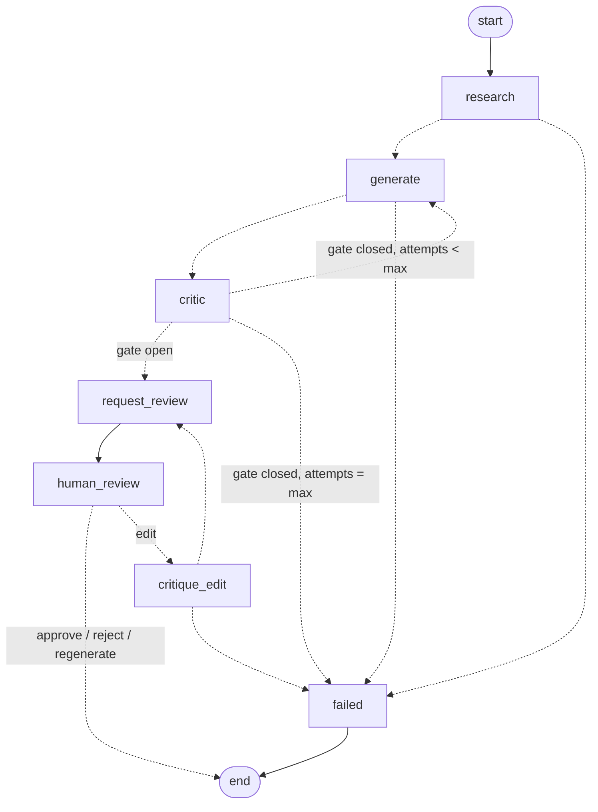

# Architecture

## 1. Product purpose

social-growth-agent helps creators, technical founders and small businesses grow on X. It
researches what is working in their niche, drafts posts that fit their strategy, critiques the
drafts, asks a human to approve them, publishes, measures the results, and feeds what it learns
back into the next round. The engineering goal is a **closed, measurable learning loop** with
clear control flow, not a pile of prompts.

## 2. Deterministic orchestration, probabilistic agents

The central design rule, added in Phase 2 when real LLMs arrived:

> **LLMs produce typed judgements. Deterministic code decides what happens next.**

| Decided by the LLM (probabilistic) | Decided by application code (deterministic) |
|---|---|
| Research themes, opportunities, confidence | Which posts the research is based on, and where they came from (`ResearchSource`) |
| Post text, hook, rationale, which earlier candidate it revises | Ids, lineage, attempt numbers, strategy version |
| Critic recommendation, score, risks, soft issues | Hard policy (length, format, blank content) and the **final verdict** |
| | Whether the batch is good enough for review (`CriticGate`) |
| | Whether to retry, how many times, and when to fail (`RunConfig`, routing) |
| | Human review, the edit invariant, and approval eligibility |

The model never returns a routing instruction, and nothing in its output is used as one. Routing
functions (`graph/routing.py`) read only validated state. A model that misbehaves can at worst
produce output that fails validation, and then the run fails with a recorded error.

## 3. The learning loop

```
Research -> Content generation -> Critic -> Human approval -> Publishing
    ^                                                              |
    |                                                              v
Strategy update  <-----------------  Analytics  <----------  Metrics collection
```

Phases 1 and 2 implement research through human approval. The right half of the loop exists in
the types (`PublishState`, `PostMetrics`, `PerformanceInsight`, `Experiment`) but has no nodes yet.

## 4. Agents and their contracts

Every agent is a small class. It renders a prompt, calls the provider through
`agents/base.call_llm`, then converts the **LLM output schema** into **domain objects** inside
`validating_output`. The two schemas are deliberately separate. The model never invents ids or
lineage, and every cross-reference is checked. A violation raises `AgentOutputError` carrying
the `LLMCall` record.

| Agent | LLM output schema | Validated into | Checks |
|---|---|---|---|
| Research | `ResearchReport{topic, summary, findings[theme, summary, evidence_post_ids, signal_strength], content_opportunities[angle, rationale, finding_indexes], confidence, limitations}` | `list[ResearchFinding]`, `ResearchBrief` | evidence ids ⊆ supplied posts; opportunity indexes valid; ≥1 finding; a synthetic-data limitation is appended by code |
| Content | `CandidateBatch{candidates[content, topic, hook_type, format, target_audience, research_finding_ids, rationale, revises_candidate_id]}` | `list[ContentCandidate]` | 1..count candidates; finding ids known; `revises_candidate_id` must be one of the previous attempt's critiqued candidates |
| Critic | `CriticReport{evaluations[candidate_id, recommendation, score, tone_match, factual_risk, originality_risk, issues[category, detail], suggested_revision]}` | `list[Critique]` | exactly one evaluation per candidate; score 0..1; then hard policy |

Prompts live in `agents/prompts/*.md`. Each has Role, Objective, Available inputs, Output
contract, and Rules/Limitations. The research prompt states that the material is supplied by the
application and that the model must not claim to have browsed X or any other source.

LLM output schemas contain no defaults, so every field is required. A test checks each one
against OpenAI's strict-mode schema converter (`tests/test_llm_contracts.py`).

## 5. Critic: hard policy vs. LLM judgement

```
candidate --> LLM evaluation (recommendation, score, risks, soft issues)
          --> policies.find_violations(candidate, ContentPolicy)   # hard rules, code only
          --> policies.final_verdict(recommendation, violations)   # violation => never PASS
          --> Critique{verdict, recommended_verdict, assessment, issues, policy_violations}
```

- **Soft issues** come from the model: `weak_hook`, `unclear`, `low_usefulness`, `boring`,
  `off_brand`, `off_strategy`, `unsupported_claim`, `not_suited_to_x`, `other`.
- **Hard violations** come from code: `max_post_length`, `allowed_format`, `non_blank_content`.
  `ContentPolicy(max_post_length=280, allowed_formats={single})` is configured per run through
  `RunConfig.content_policy`. A new rule is one small `HardRule` class added to `DEFAULT_RULES`.
- A violation downgrades the model's `pass` to `revise`, so the retry loop can fix it. The model's
  `reject` is never upgraded. Both `recommended_verdict` and `verdict` are stored, so disagreement
  between the model and the policy is measurable.

### Critic gate

`policies.CriticGate` is the only place that decides whether a batch may go to human review. The
Phase 2 default is at least one passing candidate. It already supports `min_passing_candidates`
and `min_best_score`, and aggregate or per-dimension thresholds would go here too. Routing
(`route_after_critique`) and `request_review` both ask the gate; neither reimplements it.

## 6. Graph



### Retry feedback loop

When the gate is closed and attempts remain, `generate` runs again with
`GraphState.revision_feedback()`: every non-passing candidate of the last attempt paired with its
critique (verdict, soft issues, hard violations, suggested revision). The Content Agent is told to
revise those posts, not start over, and each new candidate records `revises_candidate_id`. The
chain attempt 1 → critique → attempt 2 is therefore explicit in state. The number of attempts is
`RunConfig.max_generation_attempts` (default 3, hard ceiling 10). The model has no say in it.

### Human edit invariant

> Materially edited content must pass critique again before it can be approved.

- An edit never mutates a candidate. `policies.edited_candidate` creates a new candidate with
  `origin=human_edit` and `revises_candidate_id=<original>`. Whitespace-only edits are refused as
  non-material.
- `human_review --edit--> critique_edit`. That node runs the full critic (LLM plus hard policy) on
  the edited candidate, then returns to `request_review`.
- `review.candidate_ids` only ever holds candidates whose latest critique passed. Approval is
  checked against it, and against `latest_critique(candidate).passed` as defence in depth. An edit
  that fails is shown to the reviewer as `ReviewRequest.rejected_edit` and cannot be approved.
- Edits are bounded by `RunConfig.max_edit_rounds` (default 3).

The unsafe path, critic passes → human edits → publish, does not exist in the graph.

### Failure handling

| Failure | Mechanism | Outcome |
|---|---|---|
| Rate limit, connection error, 5xx, timeout (`TransientProviderError`) | LangGraph `RetryPolicy` on provider-calling nodes | retried up to 3 attempts; then as below |
| Any provider error left after retries, or a non-retryable one (auth, 4xx) | node `error_handler` (`provider_error_handler`) | `RunError` recorded, `status=failed`, `goto failed`. `start_run` returns normally. |
| Invalid, truncated or filtered output, empty result, refusal, contract violation (`RunAbortError`) | `instrument` wrapper | `RunError` recorded, routed to `failed`, not retried |
| Missing API key | `ConfigurationError` at startup | no run is created |
| Bad review decision | `InvalidReviewError` to caller | run stays paused |

There is no silent fallback to fake content. `LLM_PROVIDER=fake` must be chosen explicitly.

## 7. State model

`GraphState` (`graph/state.py`) is a Pydantic model:

| Group | Fields |
|---|---|
| Identity and inputs | `run_id`, `started_at`, `account`, `strategy`, `config` (limits, `content_policy`, `critic_gate`) |
| Work products | `research`, `research_brief`, `candidates` (append), `critiques` (append) |
| Decisions and results | `review` (status, candidate ids, decision, edit rounds, pending/rejected edit), `publish`, `metrics`, `insights` |
| Control | `status`, `research_attempts`, `generation_attempts`, `errors` (append), `events` (append) |
| LLM trace | `llm_calls` (append): agent, task, provider, model, attempt, outcome, latency, token usage, error type |

Candidates and critiques accumulate across attempts and edits. Helpers derive the views:
`current_candidates()` (generated, latest attempt), `reviewable_critiques()` (via the gate),
`revision_feedback()` and `latest_critique(id)`. Nodes return partial `StateUpdate`s, and domain
objects are frozen.

### Traceability chain

```
SourcePost.id  <-  ResearchFinding.evidence_post_ids ; ResearchBrief.source.post_ids
ResearchFinding.id  <-  ContentCandidate.research_finding_ids ; ContentOpportunity.finding_ids
ContentStrategy.id/version  <-  ContentCandidate.strategy_id/strategy_version
ContentCandidate.id  <-  ContentCandidate.revises_candidate_id (model retry or human edit)
ContentCandidate.id  <-  Critique.candidate_id  <-  ReviewDecision.candidate_id
ContentCandidate.id  <-  PublishedPost.candidate_id             (Phase 5)
PublishedPost.platform_post_id  <-  PostMetrics                 (Phase 6)
```

## 8. Provider boundary

```
agents  --LLMRequest-->  LLMProvider (Protocol)  --LLMResponse[T]-->  agents
                           |-- OpenAIProvider   (providers/openai_provider.py, the only SDK import)
                           |-- ScriptedLLMProvider (tests, demo)
```

- `LLMProvider.generate_structured(request, schema) -> LLMResponse[T]` (output, model, token usage).
- `LLMRequest` carries `agent`, `task`, `system`, `prompt`, a structured `payload` (used by fakes
  and evals, ignored by real adapters), `generation_attempt`, and `LLMSettings` (provider, model,
  temperature or none, max output tokens, structured-output strategy).
- `OpenAIProvider` uses the Responses API, `responses.parse(text_format=schema)`, so the schema
  is enforced server-side and validated again client-side. SDK retries are disabled so the
  graph's `RetryPolicy` is the only retry budget. It maps SDK exceptions onto the domain hierarchy
  in `errors.py`.
- Configuration (`config.AppSettings`, env or `.env`): `LLM_PROVIDER`, `OPENAI_API_KEY` (a
  `SecretStr`), `OPENAI_MODEL`, `LLM_TIMEOUT_SECONDS`, `LLM_TEMPERATURE_ENABLED`.
  `services.factory.build_dependencies` is the only place that turns settings into dependencies.
- **Per-agent configuration.** `AgentSettings` holds one `LLMSettings` per agent, and
  `Dependencies.agent_llms` can give any agent its own provider (for example a cheaper critic).
  Graph code is unaffected.

Social platforms sit behind `SocialResearchProvider` (which also declares `source_name` and
`synthetic`), `SocialPublisher` and `SocialAnalyticsProvider`, each with deterministic mocks.

## 9. Layering

```
api  ->  services  ->  graph  ->  agents  ->  providers (protocols)
                         \          \-> policies
                          \-> policies
                     models  <- everything      config -> services.factory, providers.factory
```

## 10. Evaluation and observability

- `evaluation/critic_eval.py` scores final critic verdicts (model plus policy) against labelled
  cases. With real models it is the regression gate for prompt and model changes.
- Every node appends a `NodeEvent`, and every LLM call appends an `LLMCall` (success or failure,
  latency, tokens). `services/trace.TracePrinter` renders both as a readable run trace. Structured
  JSON logging is in `observability/`. OpenTelemetry replaces the internals in Phase 10.
- Checkpoints deserialize only an explicit allowlist of domain and policy types.

## 11. Future phases

See [ROADMAP.md](ROADMAP.md). Next structural additions:

- the `research → enough_signal? → broaden → research` loop, bounded by `max_research_attempts`;
- `publish → wait_for_metrics → analyze → update_strategy` after approval;
- a Postgres checkpointer and SQLAlchemy tables for runs, candidates, critiques, decisions,
  LLM calls, posts and metrics.
